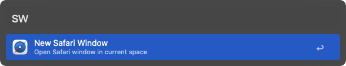
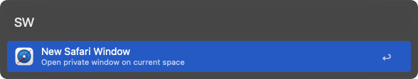

# New Safari Window | Alfred Workflow

A streamlined workflow for generating new Safari browser windows without needing to be within its interface. It facilitates the creation of both standard Safari windows and private ones.

To download it, click [here](https://github.com/vanstrouble/new-safari-window-alfred-workflow/releases/download/v0.2.0/New.Safari.Window.alfredworkflow).

This workflow is only for Alfred.app Powerpack users. Below you can see a list of commands supported:

## New window (sw)

Opens a new Safari window in the current space:
**Keyword**: sw

## New Private window (sw + ⌥)

Opens a new Safari Private window in the current space:
**Keyword**: cw + ⌥ (option)

## Clarification on Private Window Configuration

**The system language must be in Spanish.**

For an **English configuration**, you must modify the script for the private window:
- "Nueva ventana privada" to "New private window"
- "Archivo" to "File"

---

## Credits

- This workflow is highly inspired in [Caio Gondim's one](https://github.com/caiogondim/alfred-chrome-window-workflow?tab=readme-ov-file)

## License

The MIT License (MIT)

Copyright (c) 2024 Pedro Vázquez

Permission is hereby granted, free of charge, to any person obtaining a copy of this software and associated documentation files (the "Software"), to deal in the Software without restriction, including without limitation the rights to use, copy, modify, merge, publish, distribute, sublicense, and/or sell copies of the Software, and to permit persons to whom the Software is furnished to do so, subject to the following conditions:

The above copyright notice and this permission notice shall be included in all copies or substantial portions of the Software.

THE SOFTWARE IS PROVIDED "AS IS", WITHOUT WARRANTY OF ANY KIND, EXPRESS OR IMPLIED, INCLUDING BUT NOT LIMITED TO THE WARRANTIES OF MERCHANTABILITY, FITNESS FOR A PARTICULAR PURPOSE AND NONINFRINGEMENT. IN NO EVENT SHALL THE AUTHORS OR COPYRIGHT HOLDERS BE LIABLE FOR ANY CLAIM, DAMAGES OR OTHER LIABILITY, WHETHER IN AN ACTION OF CONTRACT, TORT OR OTHERWISE, ARISING FROM, OUT OF OR IN CONNECTION WITH THE SOFTWARE OR THE USE OR OTHER DEALINGS IN THE SOFTWARE.